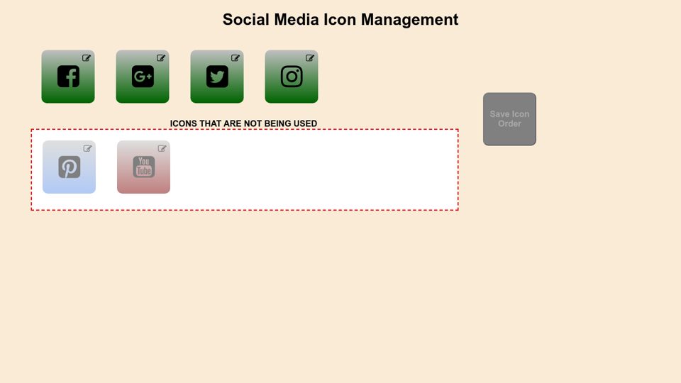

# Drag & Drop 1 - Social Media Icon Manager

## Purpose

This is an app I created to demonstrate a proof of concept for a former employer (who is currently using it). My former employer is a multilingual international company with close to 70 different versions of their website to represent the country the user is coming from. Each country's version of the website has different social media sites and each website needs the ability to have them in different orders. This information was hardcoded which required the marketing department to submit a change request to make simple changes. I solved this by creating this **_Social Media Icon Manager_**, a very easy to use tool that allows the marketing department to make changes at their leisure. To keep the integrity of the production site, a logging table was added to keep track of all changes and by whom.

_This tool is built using the following:_

- JavaScript ES6
- jQuery's _sortable_ and _dialog_
- Modular Sass

[Working Demo]http://dragdropicons.jeffolivier.codes

## How to use this app

**Green:** icons that have been set up with a title and URL and are live on your site\
**Red:** icons that have NOT been set up with either a title or URL or both\
**Blue:** icons that have been set up with a title and URL but are NOT currently being used on your site

- Each icon has an **_edit_** button (sm icon located in the upper right hand corner of each large icon) that lets you edit the title and URL to your social media site (eg. FB, Insta, ect).
- You can rearrange the order that the icons are shown in, then hit save
- You can move an icon that is being used to the white box to remove it from being seen on your website
- You can add a new icon to your website by grabbing a red one in the white area and moving it inline with the green icons
- The **_Save Order_** button only becomes **_active_** when there is an actual change to be saved
- **_Red_** icons indicate that it is missing a title or URL or both
- You can not save the order of the icons while there is a **_red_** icon present
- You can edit the URL and title of each individual icon
- This tool was not designed for use on a mobile device

---

## Integrate this with a database

### DATABASE TABLES

#### social_media_type

_This table contains all of the social media types that are available_

    id - SMALLINT(6) (primary key)
    name - char(100) (unique key)
    fa4icon - VARCHAR(100) [font awesome ver 4 icon code]
    fa5icon - VARCHAR(100) [font awesome ver 5 icon code]
    isGlobal - TINYINT(1) [T = show on all sites, F = specific to certain site(s) ]

| name      | fa4icon               | fa5icon     |
| --------- | --------------------- | ----------- |
| Facebook  | fa-facebook-square    | fab fa-aefb |
| Google+   | fa-google-plus-square | fab fa-aegp |
| Instagram | fa-instagram          | fab fa-aeig |
| Pinterest | fa-pinterest-square   | fab fa-aept |
| Twitter   | fa-twitter-square     | fab fa-aetw |
| YouTube   | fa-youtube-square     | fab fa-aeyt |

#### social_media

_This table determins what icons are shown on what website_

    id - INT (primary key, auto increment)
    siteCode - CHAR(5) [code representing which site this SM icon belongs on]
    typeId - SMALLINT(6) (primary key) [maps to the table social_media_type column id]
    title - VARCHAR(150) [title on social media icon]
    url - VARCHAR(255) [URL to your specific SM page eg. www.facebook.com/myCompany ]
    iconrder - TINYINT(4) [the order placement of this SM icon]

    * unique key = (siteCode, typeId)

#### social_media_change_log

_This table logs all changes to the social_media table and by whom_

    id - INT (primary key, auto increment)
    timestamp - DATETIME [date of the change]
    username - VARCHAR(100) [person who made the change]
    social_media_id - INT [maps to the table social_media column id]
    dbField - VARCHAR(50) [field from table social_media that was changed]
    oldData - VARCHAR(255) [original value]
    newData - VARCHAR(255) [new value]

---

### QUERY EXAMPLES

---

#### Get all of the active icons for the site named 'foo' (eg. the icons currently being shown on the website)

**_note:_** _an icon order of zero indicates that it exists, but isn't shown on the website_

> SELECT id\
> FROM social_media\
> WHERE sitecode = 'foo' AND iconOrder != 0\
> ORDER BY iconOrder DESC

OR

> SELECT typeId, title, url, iconOrder, name\
> FROM social_media AS a\
> JOIN social_media_type AS b ON b.id = a.typeId\
> WHERE siteCode = 'foo' AND iconOrder != 0\
> ORDER BY iconOrder ASC

#### Get all of the available social media icon types

> SELECT id\
> FROM social_media_type\
> WHERE isGlobal = true\
> ORDER BY id ASC

#### Get all of the information for a _SINGLE_ social media icon on the site named 'foo'

> SELECT \*\
> FROM social_media\
> WHERE siteCode = 'foo' AND typeId = 56

#### Get all of the information for a single social media icon type

> SELECT \*\
> FROM social_media_type\
> WHERE id = 3

#### Get the URL for the social media icon image

> SELECT fa5icon as image_code\
> FROM social_media_types\
> WHERE id = 3

#### Get the name of a social media icon (eg. facebook, instagram, etc.)

> SELECT name\
> FROM social_media_type\
> WHERE id = 3
